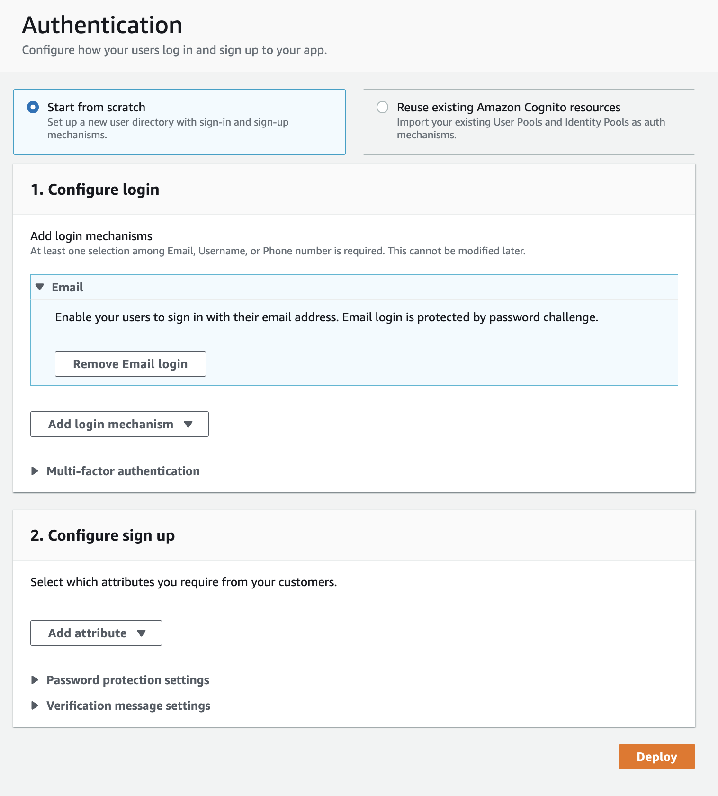
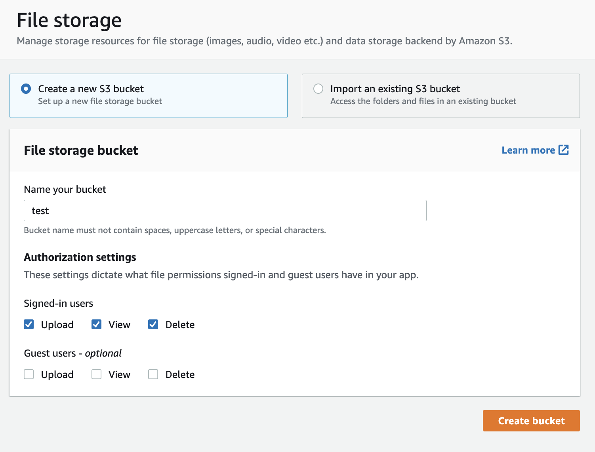
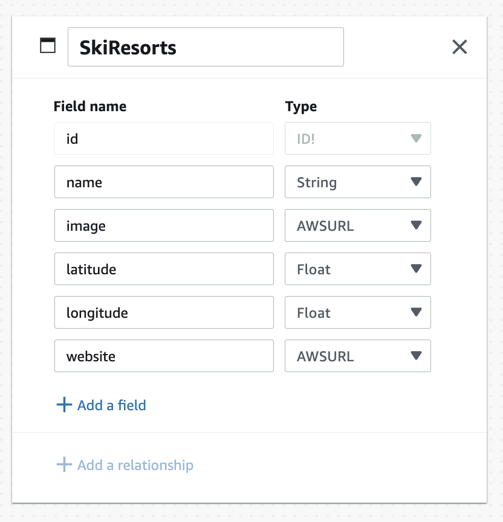
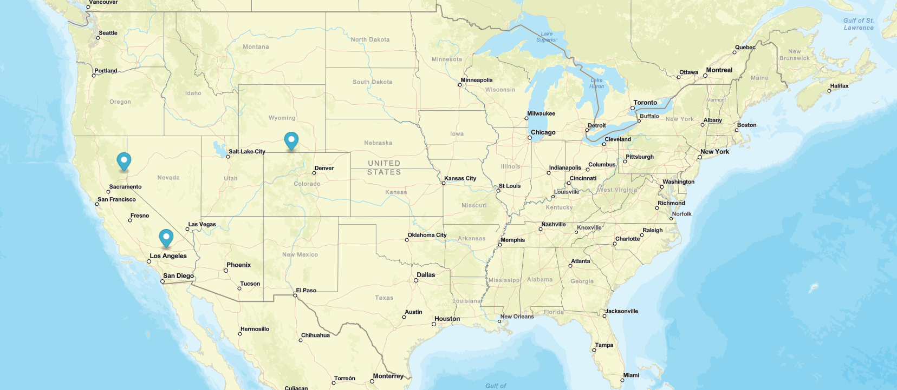
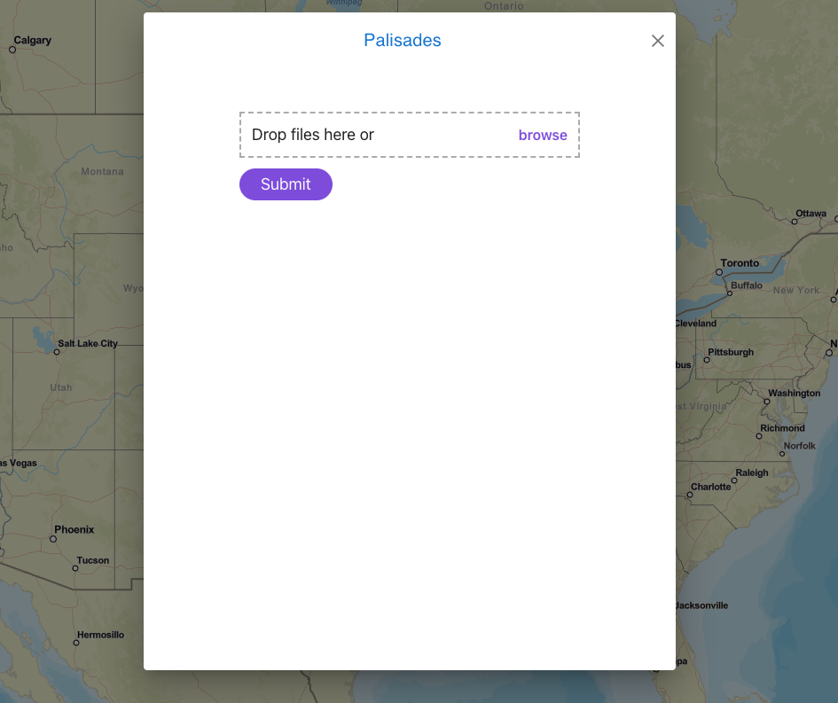

# Creating a Web Application with AWS Amplify

## Intro 

Have you ever wanted to create a web application with features such as user authentication and storage. Although it seems pretty simple, getting it all set up can be more difficult than one thinks. When researching different methods to set up my web app, I came across AWS Amplify. 

Amplify is a set of tools that let developers more easily create web applications with users and content. It allows you to easily set up user authentication using Cognito, simple content storage using S3, and a database using DyanmoDB. Usually these features would have to be set up independantly and connected together to work properly, but Amplify lets you easily connect them together and set it up with our frontend. 

As a snow sport enthuisiast, I wanted to find a way to easily organize content from my ski trips. My idea was to create a web app that has an interactive map of snow resorts, where users can upload photos and videos to each resort that they’ve been to on the map. This gives users a way to track resorts they’ve been to and visually see new resorts they could visit. It also gives them a fun and easy way to organize their photos by destination. This app must support different users and authentication, as well as storing images and associating images them to their respective users in a secure fashion. 

## Getting set up with Amplify

To use Amplify, you must first set up an AWS account. AWS offers many services for free, and some free for 12 months. you can signup [here](https://aws.amazon.com/free/?trk=78b916d7-7c94-4cab-98d9-0ce5e648dd5f&sc_channel=ps&s_kwcid=AL!4422!3!432339156165!e!!g!!aws%20free%20tier%20account&ef_id=CjwKCAjw6raYBhB7EiwABge5KqZvOFLjtY-pMFjH2H3cR4ddrMOVuHiEBue2dNvmubzyJZS1OQyHUxoCPbAQAvD_BwE:G:s&s_kwcid=AL!4422!3!432339156165!e!!g!!aws%20free%20tier%20account&all-free-tier.sort-by=item.additionalFields.SortRank&all-free-tier.sort-order=asc&awsf.Free%20Tier%20Types=*all&awsf.Free%20Tier%20Categories=*all)

Once loggen in, then head to Amplify from within the AWS console. There you can create a new app and give it a name. Once the initializtion is complete, head to Amplify Studio. You will be greeted with a very user friedly UI that gives you access to all of Amplify's features.

## User Authentication

Amplify gives you many options to configure authentication. The most basic option for signup/login is email, but there are many other options such as phone number, Google, Facebook, Amazon, and Apple. You can also add signup attributes that users enter, such as birthdate, address, and many more depending on your apps needs. They also offer multi-factor authentication. I went with just email and password as the other options were unnecessary for my use case. Once you've configured your authentication, just hit deploy. 



## Storage

My app requires users to store images and videos, which Amplify provides a solution for by utilizing Amazon S3 (Simple Storage Service). 

Note: *Authentication must be set up before storage can*

Naviage to the storage tab, where you will have the option to name you S3 bucket and configure authorization settings. I gave signed-in users authorization to upload, view, and delete their own content, and gave guest users to authorization to keep my users' content secure. Once you've decided what settings you app requires, hit **Create bucket** and you're all set. 



## Data 

In addition to storage, my app needs a database for a couple reasons.
1. To associate images to the user who uploaded them, and to also associate the image to the snow resort it was uploaded to (or so I thought)
2. To keep track of snow resorts and thier respective data (such as coordinates)

Amplify uses DyanmoDB, a NoSQL database. If your app requires a SQL databse, you will have to set that up outside of Amplify and connect it on your own. NoSQL was fine for my use case, so I stuck with it. 

To set up a data model, navigate to the Data tab and click **Add Model**. You can then add fields as well as their corresponding types. Here is an example of the data model I used for the ski resorts.



## Geo

One main component of my web app is an interactive map. To my great surprise, this was also included with Amplify. Although not availailbe through Amplify Studio, I was able to find setup instructions [here](https://docs.amplify.aws/cli/geo/maps/) which made setting up a map significaly easier for me. 

## Local Setup

Now that your backend is setup, you can start your local work. 
I used React for my frontend code, and used `create-react-app` for the basic setup and file structure. [Here](https://reactjs.org/docs/create-a-new-react-app.html) is the link to get setup with React, but you may use any frontend language or library you wish. 

Once you've set up your local environment, it's time to set up your local backend. In the top right of Amplify Studio, click **Deployment successful - click for next steps**. You will see a link to setup the Amplify CLI which you will want to do in the main directory of your project [more info](https://docs.amplify.aws/start/getting-started/installation/q/integration/react/#install-and-configure-the-amplify-cli). After that, you will see an `amplify pull` command which will get all your backend resources setup. 

## Frontend Logic

Before I continue, I'd like to point out a very cool feature. Amplify offers easy UI development with React through Figma. Figma is a no-code UI/UX development tool that allows you to easily design a website. Figma is traditionally used by a web designer to set up the design of a website and work with clients. Amplify allows you to turn Figma projects into React code. I did not opt for this option as I already knew React and wanted to code the frontend on my own, but nevertheless this is a feature that can speed up development and be useful to many people. You can learn more about it [here](https://docs.amplify.aws/console/uibuilder/figmatocode/).


### Map Markers



The most important component of my website is the interactive map. I was able to get the basic map setup through Amplify Geo, but I had to add features to make it interactive and allow users to upload images to ski resorts. My first step was adding markers at the coordinates of each resort. I was able to do this through the `Marker` component from `react-map-gl`. One issue I quickly ran into was how tedious it was to manually look up each ski resort and enter in all its relevant information. Since I did not want to have to redeploy the entire site every time I wanted to add new locations to the map, I decided to store all the ski resort information in DynamoDB and pull it every time someone entered the site. This allows me to simply add ski resorts as I please while keeping the site up to date with all the newest added resorts. This code snippet queries my `SkiResorts` table and returns all the data for each resort, which is then used to populate the map. 

```
async function getResortsData() {
    try {
        const models = await DataStore.query(SkiResorts);
        console.log(models);
        return models
    }
    catch (err) { console.log(err) }
}
```

### Uploading Content to a Resort

Now that I had markers for ski resorts, I had to add functionality to them. I used a modal (e.g. popup) that would appear every time a user clicked on a specific marker. 



Inside the modal I added a file upload component that can take multiple files and upload to AWS S3 when the user hits **Submit**. The following code snippet uploads a given file to a certain directory in my project's S3 bucket. 

```
async function uploadImage(directory, file) {
    console.log("Uploading " + directory + "/" + file.name)
    const key = await Storage.put(directory + "/" + file.name, file, {
        level: 'private',
        progressCallback(progress) {
            console.log(`Uploaded: ${progress.loaded}/${progress.total}`);
        },
    });
}
```

When I was first implemeting this, I thought I would have to use DynamoDB to keep track of which users uploaded which images. This introduced extra problems such as images with the same name, as well as security issues. To my great surprise, S3 made the need for this user:image tracking unnessecary. When an authenticated user uploads a file to S3 at the private level, they get their own directory that only they can access. This solved both the issues I had just mentioned. The only thing left was to track which resort a file was uploaded to. I implemented this by making subdirectories within each user's directory with the name of the resort. 


### Displaying Uploaded Content

Now that users could upload content in a secure and organized way, I had to implement a method for displaying content when a certain marker is clicked. The following code is used to download a specific file from a user's S3 directory. 
```
async function downloadImage(filename) {
    try {
        const signedURL = await Storage.get(filename, {
            level: 'private',
        });
        console.log(signedURL)
        return signedURL
    }
    catch (err) { console.log(err) }
}
```

Since I want to display all the user's content in a given resort, I had to query all the users file for the resort they clicked on and download them. I do this by utilizing the `Storage.list` function that will list all files for a given user. Furthermore, to only get files for a given resort, I can pass the resort name to `list` and it will only return those specific files. The following code gets a list of all a user's content for the given directory/resort, then downloads them and returns the urls in a dict. I then pass this dict to an `ImageGallery` component which displays them. 

```
async function getImageURLs(directory) {
    try {
        const list = await Storage.list(directory + '/', { level: 'private' }) // for listing ALL files without prefix, pass '' instead
        console.log(list)
        const urls = []
        for (const file of list) {
            let url = await downloadImage(file.key)
            urls.push({ url: url, key: file.key })
        }
        console.log(urls)
        return urls

    }
    catch (err) { console.log(err) }
}
```

## Conclusion

There are many more components and features in my web app that I did not cover here as I only wanted to go over the one's essential to the project. Overall, I think Amplify is a great way to setup backend resources and easily allows integration into any JavaScript app. 